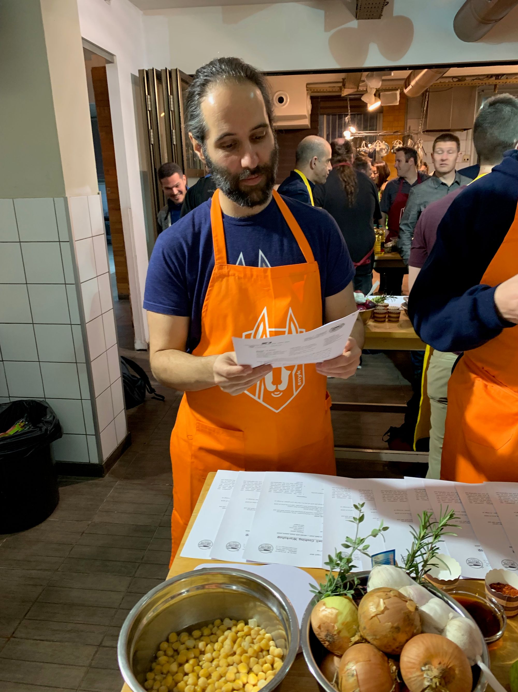

+++
title = "Tel Aviv"
slug = "tel-aviv"
date = 2019-01-20
+++

V pátek jsem se vrátil ze své už třetí návštěvy Tel Avivu. Snyk byl totiž od začátku založen napůl v Londýně a napůl v Tel Avivu, náš CEO je původně z Izraele, ale když firmu zakládal, už žil v UK (kam se přistěhoval z Kanady). Jelikož je Izrael cybersecurity velmoc a Guy od začátku budoval firmu v téhle oblasti, celkem logicky zvolil své spoluzakladatele tam. Od prvního dne máme tedy distribuovaný tým mezi Londýn a Tel Aviv (v obou městech jsou programátoři, produktový manažeři i customer success), později ještě přibyl Boston (kde jsou sales) a nějak organicky Ottawa (začal tam jeden obchodník, který k sobě přibral dalšího, pak se tam našel sales engineer a už tam budeme hledat kancelář). Abychom se taky někdy všichni potkali, organizuje se dvakrát do roka All Hands setkání. V lednu v Tel Avivu, v červenci v Londýně. Počasí je v obou případech přibližně stejné...

Do Tel Avivu jsem přiletěl v sobotu večer a naštěstí jsem ještě stihl kolegy, kteří mířili na večeři, takže můj kručící žaludek už netrpěl dlouho. Jelikož je Izrael židovský stát, v pátek se nepracuje. Další den už tedy začínal program, takže nešlo o žádnou velkou párty a celkem brzo jsem šel spát.

Kromě společenské mají All Hands i pracovní funkci. Rozdělení do různých týmu (často mix mezi programátory, security, sales, customer support) se snažíme rychle naprototypovat nějakou novou část produktu, kterou bychom mohli během následujícího půl roku rozvíjet. Byl jsem v týmu, který se věnoval testování docker image přímo z docker registrů. Docela se nám dařilo, povedlo se nám udělat takový polofunkční prototyp, takže to třeba i k nečemu bude :-) Jak už to tak ve startupech bývá, docela platí "work hard, party hard", takže večery byly obvykle vyplněny jídlem a vínem.

V pondělí večer nás ještě čekala celofiremní "social activity". V minulosti se zkoušeli různé věci - acroyoga, trampolíny, escape room. Tentokrát to ale mělo největší úspěch - měli jsme "Israeli cooking workshop" ve formě soutěže typu Masterchef. Rozdělili jsme se do týmů, dostali jsme recepty co máme uvařit a pak už jsme hodinu a půl kmitali za astitence asi pěti kuchařů, kteří nám pomáhali. Byla to legrace, byť kuchyně měla kapacitu tak na polovinu lidí. Nakonec se to ale dost povedlo a i když jsme nevyhráli, najedli jsme se dobře.

Ve středu ráno jsem se konečně vzbudil nějak rozumně, takže jsem měl čas se podívam i jinam, než jen do kanclu.  Prošel jsem si hlavní třídu (Rotschild boulevard), nakoukl k moři, do přístav a přes hipsterskou čtvrť Florentine (bydleli jsme tam při poslední návštěvě v říjnu) došel do práce. Oproti minulé návštěvě moře ke koupání nelákalo - byly asi pětimetrové vlny a docela chladno (ehm, 12 stupňů).

Kromě práce a párty je tradiční součástí All Hands i guest lecture - poměrně zajímavá osobnost nám vypráví o svém pohledu na náš produkt, firmu, strategii, open source a vlastně cokoli. Minule to byl Nat Friedman, CEO GitHubu po akvizici Microsoftem, letos Adrian Colyer, jeden z našich investorů. Bylo to super - Adrian je extrémně chytrý a přátelský, jeho půlhodinová prezentace ohledně stavu open source byla tak provázaná a promyšlená, až jsem se občas ztrácel. Na otázky taky odpovídal pohotově a srozumitelně; prostě byl přesně tím bonusem navíc, který na podobné akci chcete.

Čtvrtek byl jako poslední den volnější, po prezentacích probíhala "unconference session", kdy jsme mohli pracovat na čem jsme chtěli; dodělávat věci z předchozích dnů, pohnout s drobnostma, které nám vadí apod. Já jsem se snažil přidat instalaci naší CLI aplikace do package manageru pro OS X (homebrew), docela se to i dařilo, bohužel jsem měli incident, při kterém se nám přesměrovávala domovská stránka, takže jsme museli všeho nechat a zachraňovat svět :-)
Večer už pak byla jen závěrečná mega párty v hotelovém baru, která skončila kolem jedné ráno, což bylo dobře, protože v 8:00 už na mě čekal taxík na letiště.

Jak už jsem říkal v práci, každé All Hands jsou lepší než ty předchozí (zažil jsem troje), což je super, protože to znamená, že dokážeme zpracovat zpětnou vazbu, kterou si dáme. Měl jsem původně obavu z akce pro 85 lidí (!!! nastoupil jsem jako asi 29., před méně než rokem), ale organizace byla perfektní a všechno klaplo. A je fakt vidět, jak důležité je aspoň jednou za čas se s lidma potkat osobně - přestávají to být fotky na slacku a mluvící hlavy na callu, ale máte společné historky, vzpomínky a tím i prostor pro mnohem otevřenější a efektivnější komunikaci a spolupráci. Zároveň díky prezentacím z různých oddělení lépe chápete, co potřebují k práci sales nebo dev-rel lidi a odpadá tak celkem častý "my versus oni" problém.

_Nový swag otestován v praxi_
